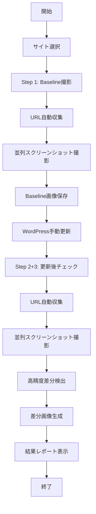
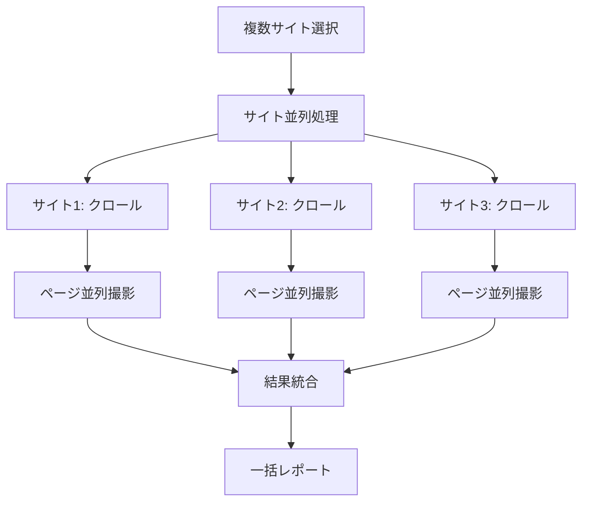
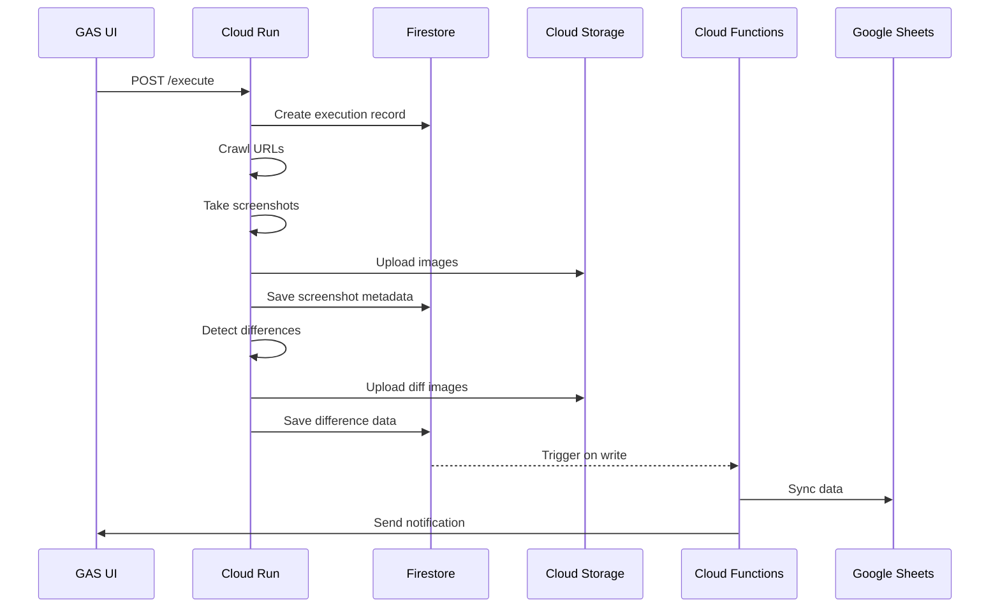

# WordPress Visual Diff Checker 仕様書

## 目次

1. [システム概要](#1-システム概要)
   - 1.1 [目的](#11-目的)
   - 1.2 [背景](#12-背景)
   - 1.3 [スコープ](#13-スコープ)
   - 1.4 [用語定義](#14-用語定義)

2. [機能要件](#2-機能要件)
   - 2.1 [ユーザーストーリー](#21-ユーザーストーリー)
   - 2.2 [機能一覧](#22-機能一覧)
   - 2.3 [画面仕様](#23-画面仕様)
   - 2.4 [操作フロー](#24-操作フロー)

3. [非機能要件](#3-非機能要件)
   - 3.1 [性能要件](#31-性能要件)
   - 3.2 [セキュリティ要件](#32-セキュリティ要件)
   - 3.3 [可用性要件](#33-可用性要件)
   - 3.4 [保守性要件](#34-保守性要件)

4. [システムアーキテクチャ](#4-システムアーキテクチャ)
   - 4.1 [全体構成](#41-全体構成)
   - 4.2 [技術スタック](#42-技術スタック)
   - 4.3 [コンポーネント詳細](#43-コンポーネント詳細)

5. [データ設計](#5-データ設計)
   - 5.1 [データモデル](#51-データモデル)
   - 5.2 [API仕様](#52-api仕様)
   - 5.3 [データフロー](#53-データフロー)

6. [インフラストラクチャ](#6-インフラストラクチャ)
   - 6.1 [ローカル環境構成](#61-ローカル環境構成)
   - 6.2 [環境設定](#62-環境設定)
   - 6.3 [ディレクトリ構成](#63-ディレクトリ構成)

7. [開発・運用要件](#7-開発運用要件)
   - 7.1 [開発環境](#71-開発環境)
   - 7.2 [実行手順](#72-実行手順)
   - 7.3 [監視・ログ](#73-監視ログ)

8. [運用コスト](#8-運用コスト)
   - 8.1 [ローカル運用](#81-ローカル運用)
   - 8.2 [将来のクラウド移行](#82-将来のクラウド移行)

---

## 1. システム概要

### 1.1 目的

WordPress Visual Diff Checkerは、WordPressサイトのプラグインやテーマの更新による視覚的な変化（UI崩れ）を自動的に検出し、サイト管理者に通知するローカル実行型のWebアプリケーションです。

**主な目的：**
- WordPress更新作業の安全性向上
- UI崩れの早期発見
- 更新作業の効率化
- 視覚的な変更履歴の記録
- 複数サイトの一括管理

### 1.2 背景

WordPressサイト管理者は以下の課題に直面しています：

1. **更新リスク**: プラグイン/テーマの更新により予期しないUI崩れが発生
2. **確認作業の負担**: 全ページを手動で確認する作業の非効率性
3. **変更の可視化**: どこが変わったのかを把握する困難さ
4. **復旧の遅延**: 問題発見が遅れることによるビジネスインパクト
5. **複数サイト管理**: 26サイト以上の管理における効率化の必要性

### 1.3 スコープ

**対象範囲:**
- WordPressサイトの視覚的差分検出
- 自動スクリーンショット取得
- 差分画像の生成と保存
- ローカルWebUI提供
- 複数サイト一括処理
- 高精度画像比較（Pixelmatch）

**対象外:**
- WordPress自体の自動更新
- HTMLソースコードの差分検出
- JavaScriptエラーの検出
- パフォーマンス測定
- 外部通知システム（現在実装なし）

### 1.4 用語定義

| 用語 | 説明 |
|------|------|
| VRT | Visual Regression Testing（視覚的回帰テスト） |
| ベースライン | 更新前の基準となるスクリーンショット |
| 差分画像 | ベースラインと更新後の画像の差異を可視化した画像 |
| しきい値 | 差分として検出する変化量の基準値（％） |
| クロール | サイト内のURLを自動的に巡回する処理 |
| セッション | 同一時点での実行を識別するタイムスタンプ |

## 2. 機能要件

### 2.1 ユーザーストーリー

**サイト管理者として：**
1. WordPress更新前後の視覚的な差分を確認したい
2. 複数サイトを一括で管理したい
3. 差分の履歴を保存し、後から確認したい
4. 高精度な画像比較で細かな変化も検出したい
5. ローカル環境で安全に実行したい

### 2.2 機能一覧

#### 2.2.1 コア機能（実装済み）

| 機能ID | 機能名 | 説明 | 実装状況 |
|--------|--------|------|--------|
| F-001 | サイト登録 | 設定ファイルによる複数サイト管理 | ✅ 完了 |
| F-002 | URL自動収集 | サイトクロールによるURL収集 | ✅ 完了 |
| F-003 | スクリーンショット撮影 | Playwrightによる高精度キャプチャ | ✅ 完了 |
| F-004 | 差分検出 | Pixelmatchによる高精度比較 | ✅ 完了 |
| F-005 | レポート生成 | WebUIでの結果表示 | ✅ 完了 |
| F-006 | 履歴管理 | ローカルファイルシステムでの保存 | ✅ 完了 |
| F-007 | 複数サイト処理 | 26サイト以上の一括処理 | ✅ 完了 |
| F-008 | 並列処理 | 高速な同時実行 | ✅ 完了 |
| F-009 | WordPress最適化 | 遅延読み込み・アニメーション対応 | ✅ 完了 |
| F-010 | 3ステップワークフロー | Step1→Step2→Step3の操作フロー | ✅ 完了 |

#### 2.2.2 管理機能（実装済み）

| 機能ID | 機能名 | 説明 | 実装状況 |
|--------|--------|------|--------|
| M-001 | 設定管理 | しきい値・デバイス設定 | ✅ 完了 |
| M-002 | ファイル管理 | 画像・差分ファイルの管理 | ✅ 完了 |
| M-003 | WebUI | ブラウザベースの操作画面 | ✅ 完了 |
| M-004 | REST API | フロントエンドとの連携 | ✅ 完了 |

### 2.3 画面仕様

#### 2.3.1 メイン画面（Web UI）

```
+------------------------------------------+
|  WordPress Visual Diff Checker           |
+------------------------------------------+
| [Step 1: Baseline] [Step 2+3: Check]    |
+------------------------------------------+
| サイト一覧:                              |
| ☑ site-1-アンカーキック (20 URLs)        |
| ☑ site-2-訪問介護ステーション (15 URLs) |
| ☐ site-3-dインベストメント (25 URLs)     |
| ... (26サイト以上)                       |
+------------------------------------------+
| 実行設定:                                |
| しきい値: [2.0]%  デバイス: [Desktop ▼] |
| 並列処理: サイト[3] ページ[5]           |
+------------------------------------------+
```

#### 2.3.2 結果表示画面

```
+------------------------------------------+
| 実行結果 - 2025/01/15 14:30             |
+------------------------------------------+
| 処理サイト: 3/26  差分検出: 5件         |
+------------------------------------------+
| サイト: site-1-アンカーキック           |
| ページ: 15/15  NG: 2件                  |
| [詳細表示] [差分画像一覧]               |
+------------------------------------------+
| URL: /about                              |
| 差分率: 8.5%                             |
| [ベースライン] [更新後] [差分画像]       |
+------------------------------------------+
```

### 2.4 操作フロー

#### 2.4.1 3ステップワークフロー



#### 2.4.2 並列処理フロー



## 3. 非機能要件

### 3.1 性能要件

| 項目 | 要件 | 備考 |
|------|------|------|
| 同時実行数 | 5サイト | Cloud Runのインスタンス数で調整 |
| 処理時間 | 100URL/10分以内 | 並列処理により実現 |
| レスポンスタイム | UI操作: 3秒以内 | |
| スループット | 1000URL/時間 | |
| ストレージ容量 | 10GB/月 | 自動削除により管理 |

### 3.2 セキュリティ要件

| 項目 | 要件 | 実装方法 |
|------|------|----------|
| 認証 | Google認証 | OAuth 2.0 |
| 通信暗号化 | HTTPS必須 | Cloud Run標準 |
| データ暗号化 | 保存時暗号化 | GCS/Firestore標準 |
| アクセス制御 | IAMベース | GCPのIAM |
| 監査ログ | 全操作記録 | Cloud Logging |

### 3.3 可用性要件

| 項目 | 要件 | 備考 |
|------|------|------|
| 稼働率 | 99.5% | 月間ダウンタイム: 3.6時間 |
| MTBF | 720時間 | |
| MTTR | 1時間 | |
| バックアップ | 日次 | Firestoreの自動バックアップ |
| 災害復旧 | 24時間以内 | |

### 3.4 保守性要件

- モジュール化されたアーキテクチャ
- 包括的なログ出力
- 自動テストカバレッジ: 80%以上
- ドキュメントの自動生成
- コンテナベースのデプロイ

## 4. システムアーキテクチャ

### 4.1 全体構成

```
┌─────────────────┐     ┌──────────────────┐
│   Users         │────▶│  Google Apps     │
│                 │     │  Script (UI)     │
└─────────────────┘     └────────┬─────────┘
                                 │
                    ┌────────────▼─────────────┐
                    │   Cloud Run              │
                    │  (Screenshot Service)    │
                    └────────────┬─────────────┘
                                 │
                 ┌───────────────┴───────────────┐
                 ▼                               ▼
        ┌────────────────┐              ┌────────────────┐
        │ Google Drive   │              │   Firestore    │
        │ (Images)       │              │ (Metadata)     │
        └────────────────┘              └────────┬───────┘
                                                 │
                                        ┌────────▼────────┐
                                        │ Cloud Functions │
                                        │ (Sync/Cleanup)  │
                                        └────────┬────────┘
                                                 │
                                   ┌─────────────┴──────────────┐
                                   ▼                            ▼
                          ┌────────────────┐           ┌────────────────┐
                          │ Google Sheets  │           │ Slack/Discord  │
                          │ (Reports)      │           │ (Notifications)│
                          └────────────────┘           └────────────────┘
```

### 4.2 技術スタック

#### フロントエンド
- **Google Apps Script**: Web UIとしてHTML Serviceを使用
- **HTML5/CSS3**: レスポンシブデザイン
- **Vanilla JavaScript**: 軽量なクライアントサイド処理

#### バックエンド
- **Node.js 20.x**: ランタイム環境
- **Express.js**: Webフレームワーク
- **Playwright**: ブラウザ自動化（スクリーンショット）
- **Sharp**: 画像処理（リサイズ、フォーマット変換）
- **Pixelmatch**: 画像差分検出

#### インフラストラクチャ
- **Google Cloud Platform**
  - Cloud Run: コンテナ実行環境
  - Cloud Storage: 画像ストレージ
  - Firestore: メタデータDB
  - Cloud Functions: イベント駆動処理
  - Cloud Scheduler: 定期実行
  - Cloud Build: CI/CD

#### 開発ツール
- **TypeScript**: 型安全性
- **ESLint/Prettier**: コード品質
- **Jest**: ユニットテスト
- **Docker**: コンテナ化
- **GitHub Actions**: CI/CD補助

### 4.3 コンポーネント詳細

#### 4.3.1 Google Apps Script UI

**責務:**
- ユーザーインターフェースの提供
- Cloud Runサービスの呼び出し
- 実行結果の表示

**主要ファイル:**
```
gas/
├── src/
│   ├── Code.gs         # メインロジック
│   ├── index.html      # UI HTML
│   ├── styles.html     # CSS
│   └── script.html     # クライアントJS
└── appsscript.json     # マニフェスト
```

#### 4.3.2 Cloud Run Service

**責務:**
- URLクロール
- スクリーンショット撮影
- 差分検出
- レポート生成

**主要モジュール:**
```javascript
// index.js
const crawler = require('./crawler');
const screenshot = require('./screenshot');
const diff = require('./diff');

app.post('/execute', async (req, res) => {
  const { sites, mode, config } = req.body;
  
  // Step 1: Crawl URLs
  const urls = await crawler.crawlSites(sites);
  
  // Step 2: Take screenshots
  const images = await screenshot.capture(urls, config);
  
  // Step 3: Detect differences (if mode === 'check')
  if (mode === 'check') {
    const differences = await diff.detect(images);
    await reportGenerator.create(differences);
  }
  
  res.json({ success: true, results });
});
```

#### 4.3.3 Cloud Functions

**責務:**
- Firestore → Sheets同期
- 古い画像の自動削除
- 通知送信

**トリガー:**
- Firestore書き込み
- Cloud Schedulerによる定期実行

## 5. データ設計

### 5.1 データモデル

#### 5.1.1 Firestore Collections

**sites コレクション**
```javascript
{
  id: "site-123",
  name: "サイトA",
  url: "https://example.com",
  auth: {
    type: "basic",
    username: "encrypted",
    password: "encrypted"
  },
  config: {
    threshold: 5,
    viewport: { width: 1920, height: 1080 },
    excludeSelectors: [".dynamic-content"]
  },
  createdAt: Timestamp,
  updatedAt: Timestamp
}
```

**executions コレクション**
```javascript
{
  id: "exec-456",
  siteId: "site-123",
  mode: "baseline" | "check",
  status: "running" | "completed" | "failed",
  stats: {
    totalUrls: 100,
    processedUrls: 100,
    differencesFound: 5
  },
  startedAt: Timestamp,
  completedAt: Timestamp
}
```

**screenshots コレクション**
```javascript
{
  id: "screenshot-789",
  executionId: "exec-456",
  url: "/about",
  type: "baseline" | "current",
  imagePath: "gs://bucket/path/to/image.png",
  metadata: {
    width: 1920,
    height: 1080,
    size: 1024000
  },
  createdAt: Timestamp
}
```

**differences コレクション**
```javascript
{
  id: "diff-012",
  executionId: "exec-456",
  url: "/about",
  diffPercentage: 8.5,
  pixelsDiff: 16320,
  baselineId: "screenshot-789",
  currentId: "screenshot-790",
  diffImagePath: "gs://bucket/path/to/diff.png",
  createdAt: Timestamp
}
```

### 5.2 API仕様

#### 5.2.1 REST API エンドポイント

**POST /api/execute**
```javascript
// Request
{
  "sites": ["site-123", "site-456"],
  "mode": "baseline" | "check",
  "config": {
    "threshold": 5,
    "device": "desktop" | "mobile" | "tablet"
  }
}

// Response
{
  "executionId": "exec-789",
  "status": "started",
  "estimatedTime": 600
}
```

**GET /api/executions/:id**
```javascript
// Response
{
  "id": "exec-789",
  "status": "completed",
  "results": {
    "totalUrls": 100,
    "differences": [
      {
        "url": "/about",
        "diffPercentage": 8.5,
        "images": {
          "baseline": "https://...",
          "current": "https://...",
          "diff": "https://..."
        }
      }
    ]
  }
}
```

**GET /api/sites**
```javascript
// Response
{
  "sites": [
    {
      "id": "site-123",
      "name": "サイトA",
      "url": "https://example.com",
      "lastExecution": "2025-01-15T10:00:00Z"
    }
  ]
}
```

### 5.3 データフロー



## 6. インフラストラクチャ

### 6.1 GCP構成

#### 6.1.1 リソース一覧

| サービス | リソース名 | 用途 | スペック |
|----------|-----------|------|----------|
| Cloud Run | vrt-service | メインサービス | 2 vCPU, 4GB RAM |
| Cloud Storage | vrt-images | 画像保存 | Standard, Multi-region |
| Firestore | vrt-db | メタデータ | Multi-region |
| Cloud Functions | vrt-sync | データ同期 | 256MB RAM |
| Cloud Functions | vrt-cleanup | クリーンアップ | 256MB RAM |
| Cloud Scheduler | vrt-scheduler | 定期実行 | - |

#### 6.1.2 ネットワーク構成

- VPCは使用せず、すべてのサービスはパブリックエンドポイント経由
- Cloud Run Ingressはinternal-and-cloud-loadbalancing
- IAMによるサービス間認証

### 6.2 環境設定

#### 6.2.1 環境変数

**Cloud Run**
```bash
PROJECT_ID=your-project-id
BUCKET_NAME=vrt-images
FIRESTORE_DB=vrt-db
LOG_LEVEL=info
MAX_CONCURRENT_BROWSERS=5
SCREENSHOT_TIMEOUT=30000
```

**Cloud Functions**
```bash
SHEETS_ID=your-sheets-id
SLACK_WEBHOOK_URL=https://hooks.slack.com/...
DISCORD_WEBHOOK_URL=https://discord.com/api/webhooks/...
RETENTION_DAYS=30
```

#### 6.2.2 シークレット管理

Google Secret Managerを使用:
- API認証情報
- Webhook URL
- サイト認証情報（暗号化）

### 6.3 CI/CD

#### 6.3.1 GitHub Actions ワークフロー

```yaml
name: Deploy to Cloud Run

on:
  push:
    branches: [main]
    paths:
      - 'cloud-run/**'

jobs:
  deploy:
    runs-on: ubuntu-latest
    steps:
      - uses: actions/checkout@v3
      
      - id: auth
        uses: google-github-actions/auth@v1
        with:
          workload_identity_provider: ${{ secrets.WIF_PROVIDER }}
          service_account: ${{ secrets.WIF_SERVICE_ACCOUNT }}
      
      - name: Set up Cloud SDK
        uses: google-github-actions/setup-gcloud@v1
      
      - name: Build and Push Container
        run: |
          gcloud builds submit \
            --tag gcr.io/$PROJECT_ID/vrt-service \
            ./cloud-run
      
      - name: Deploy to Cloud Run
        run: |
          gcloud run deploy vrt-service \
            --image gcr.io/$PROJECT_ID/vrt-service \
            --region asia-northeast1 \
            --platform managed
```

## 7. 開発・運用要件

### 7.1 開発環境

#### 7.1.1 必要なツール

- Node.js 20.x
- Docker Desktop
- Google Cloud SDK
- clasp (Google Apps Script CLI)
- Git

#### 7.1.2 ローカル開発セットアップ

```bash
# リポジトリクローン
git clone https://github.com/your-org/wordpress-visual-diff-checker.git
cd wordpress-visual-diff-checker

# 依存関係インストール
npm install

# 環境変数設定
cp .env.example .env
# .envファイルを編集

# ローカル実行
npm run dev

# テスト実行
npm test

# ビルド
npm run build
```

### 7.2 デプロイ手順

#### 7.2.1 初回セットアップ

1. GCPプロジェクト作成
2. 必要なAPIの有効化
3. サービスアカウント作成
4. GitHub Secretsの設定
5. Terraformによるインフラ構築

```bash
# Terraformでインフラ構築
cd terraform
terraform init
terraform plan
terraform apply
```

#### 7.2.2 アプリケーションデプロイ

```bash
# Cloud Runデプロイ
make deploy-cloud-run

# Cloud Functionsデプロイ
make deploy-functions

# GAS UIデプロイ
make deploy-gas
```

### 7.3 監視・ログ

#### 7.3.1 監視項目

| 項目 | しきい値 | アラート先 |
|------|----------|------------|
| Cloud Run CPU使用率 | > 80% | Slack |
| メモリ使用率 | > 90% | Slack |
| エラー率 | > 5% | PagerDuty |
| レスポンスタイム | > 10s | Slack |
| ストレージ使用量 | > 80% | Email |

#### 7.3.2 ログ設計

**構造化ログフォーマット:**
```json
{
  "timestamp": "2025-01-15T10:30:00Z",
  "severity": "INFO",
  "executionId": "exec-123",
  "action": "screenshot.capture",
  "url": "/about",
  "duration": 2500,
  "status": "success",
  "metadata": {
    "device": "desktop",
    "viewport": "1920x1080"
  }
}
```

## 8. コスト計画

### 8.1 初期費用

| 項目 | 費用 | 備考 |
|------|------|------|
| 開発環境構築 | ¥0 | GCP無料枠利用 |
| ドメイン取得 | ¥0 | サブドメイン利用 |
| SSL証明書 | ¥0 | Cloud Run標準 |
| **合計** | **¥0** | |

### 8.2 運用費用

**月間30サイト、300URL/サイトの場合:**

| サービス | 単価 | 使用量 | 月額費用 |
|----------|------|--------|----------|
| Cloud Run | ¥0.00005/vCPU秒 | 50時間 | ¥3,000 |
| Cloud Storage | ¥2.6/GB | 800GB | ¥2,080 |
| Firestore | ¥0.036/読み取り | 1M ops | ¥360 |
| Cloud Functions | ¥0.0000004/GB秒 | 10GB時間 | ¥144 |
| ネットワーク | ¥12/GB | 10GB | ¥120 |
| **合計** | | | **¥5,704** |

### 8.3 スケーリング計画

| フェーズ | サイト数 | 月額費用 | 対応策 |
|----------|----------|----------|--------|
| Phase 1 | 〜30 | ¥5,704 | 基本構成 |
| Phase 2 | 〜100 | ¥15,000 | インスタンス数増加 |
| Phase 3 | 〜300 | ¥40,000 | 専用インスタンス |
| Phase 4 | 300〜 | 要見積 | エンタープライズ構成 |

**コスト最適化施策:**
- 画像の自動圧縮（WebP変換）
- 古いデータの自動アーカイブ
- 実行時間の最適化
- リザーブドインスタンスの利用

---

## 付録

### A. 設定ファイルサンプル

**docker-compose.yml (ローカル開発用)**
```yaml
version: '3.8'
services:
  app:
    build: ./cloud-run
    ports:
      - "8080:8080"
    environment:
      - NODE_ENV=development
      - PROJECT_ID=local-dev
    volumes:
      - ./cloud-run/src:/app/src
      - ./local-data:/data
```

**sites-config.json**
```json
{
  "sites": [
    {
      "id": "site-1",
      "name": "デモサイト",
      "url": "https://demo.example.com",
      "sitemapUrl": "https://demo.example.com/sitemap.xml",
      "auth": null,
      "config": {
        "threshold": 5,
        "maxUrls": 100,
        "viewport": {
          "width": 1920,
          "height": 1080
        },
        "waitForSelector": ".main-content",
        "excludeSelectors": [
          ".timestamp",
          ".random-banner"
        ]
      }
    }
  ]
}
```

### B. トラブルシューティング

| 問題 | 原因 | 解決策 |
|------|------|--------|
| スクリーンショット失敗 | タイムアウト | waitForSelectorの調整 |
| 差分誤検出 | 動的コンテンツ | excludeSelectorsに追加 |
| メモリ不足 | 画像サイズ大 | Cloud Runメモリ増加 |
| 認証エラー | IAM設定 | サービスアカウント確認 |

### C. 今後の拡張計画

1. **機能拡張**
   - モバイルアプリ対応
   - A/Bテスト結果の可視化
   - パフォーマンス測定統合

2. **技術改善**
   - AIによる重要度判定
   - 自動修正提案
   - マルチリージョン対応

3. **ビジネス展開**
   - SaaS版の提供
   - エンタープライズ機能
   - API公開